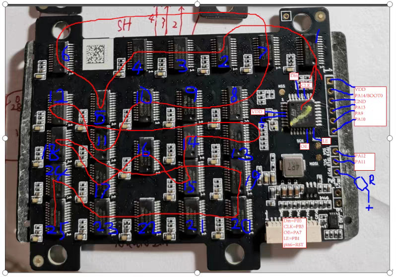
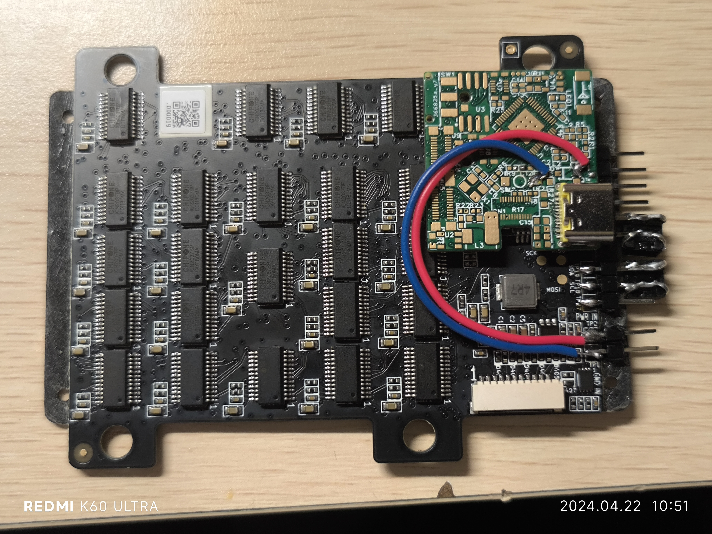
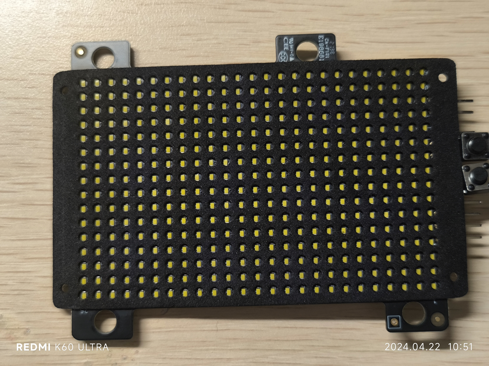

# ICN2037 with Life Game

## 构建

```shell
cargo build --release
cargo run --release
```


## 使用方法

1. 生命游戏模式：
    1. 短按 A 键：改变当前显示亮度
    2. 长按 A 键：进入照明模式
    3. 短按 B 键：重新生成随机状态
    4. 同时短按 A 键和 B 键：改变步进速度
2. 照明模式：
    1. 按 A 键：返回生命游戏模式
    2. 短按 B 键：单步改变当前显示亮度
    3. 长按 B 键：连续改变当前显示亮度

## 特性

1. 通过 PWM 抖动实现 16 级灰度
2. 较好的显示模式：最高亮度+第三级速度，最低亮度+第一级速度
3. 全异步设计，由于无法使用 DMA，同时需要保证像素刷新速度，因此按键可能有延迟，但是所有按键操作都会被处理
4. 程序状态实时存储在内部 Flash 中，断电后自动恢复
5. 照明模式下最高亮度功率约 7W，若没有散热措施不建议开启超过 1 分钟
5. 生命游戏中检测到当前状态陷入 1~2 周期循环则重新随机生成状态，选择已有模板进行插入

## 硬件

1. stm32g070kb，128KiB Flash、36 KiB RAM
2. ICN2037 x 25 控制 25 x 16 LEDs
3. 
4. 实际走向比上图规整
5. 
